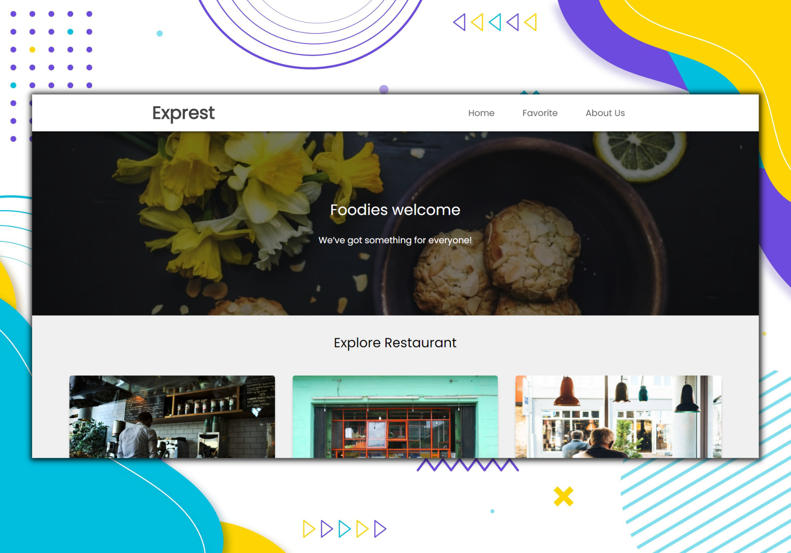

# Exprest
[](https://github.com/shidqimlna/express/blob/master/LICENSE)

Restaurant catalog web app

<hr>

<hr>

## Features
* Progressive Web Apps
* REST API
* JavaScript Clean Code
* Automation Testing 

## How to Use

#### for install npm
```console
npm install
```

#### for run 
``` console
npm run start-dev
```

#### for build
``` console
npm run build
```
